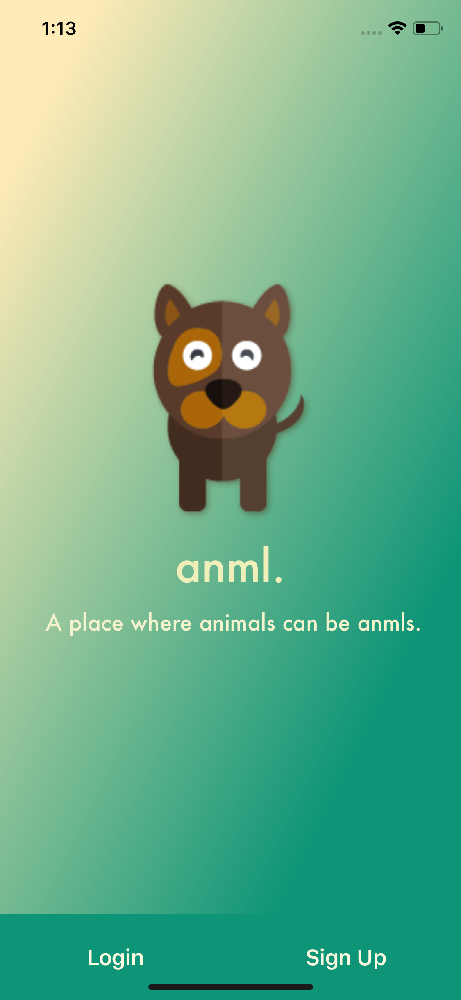
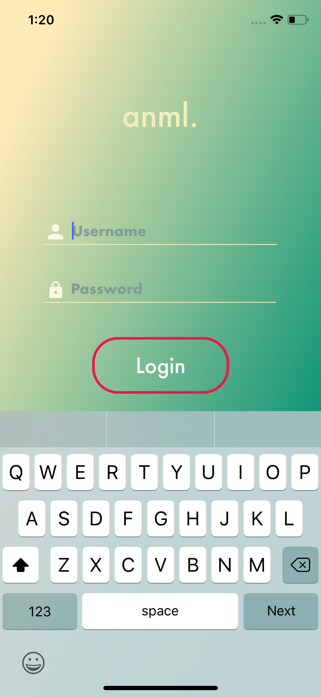
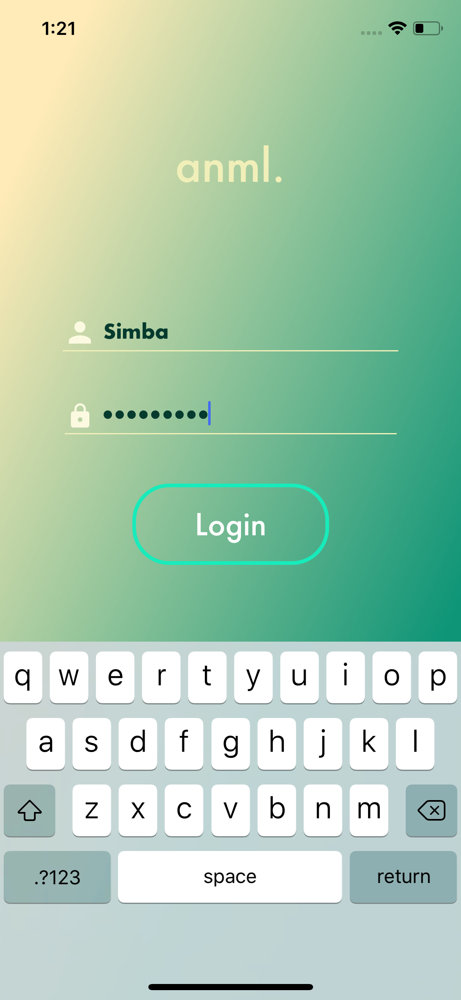

# anml mobile app

This repo is the react native mobile app for anml.

## What's anml?

**anml is a social network for pets.**

- Your pets can **sign up or login** using their paws.
- They can **upload selfies** or **post their thoughts** for other pets to see.
- They can also look at **other pets posts** and either **paw** (like) or **scratch** (dislike) it.

### [Demo - Try it on Expo](https://exp.host/@ryanliszewski/anml)

## Getting started

```
git clone git@github.com:ryanliszewski/anml.git

exp start

exp ios
```

## Assignment #1

### Objectives

- Learn how to build & organize screens in RN
- Learn advanced RN styling and use LinearGradient, Image, Icons & Custom Fonts
- Learn how to use mock data for prototyping UI screens
- Learn how to use NPM libaries such as React Native Elements, Expo & React Native Vector Icons

## Designs

Intro, Login & Sign up screen based on Robinhood App.

Profile screen based on Instagram.

Social feed screen based on Facebook.

### TODO

- [x] Design & build an Intro Screen
- [ ] :star: **Bonus:** Add [Snap Carousel](https://github.com/archriss/react-native-snap-carousel) with [Lottie animations](https://docs.expo.io/versions/latest/sdk/lottie.html) to Intro Screen
- [ x ] Design & build an Signup Screen
- [ ] :star: **Bonus:** Add buttons to sign up with Facebook & Twitter
- [ x ] Design & build an Login Screen
- [ ] :star: **Bonus:** Add buttons to login with Facebook & Twitter
- [ x ] Design & build an Profile Screen
- [ ] :star: **Bonus:** Add the Logout button
- [ x ] Design & build an Social Feed Screen with [Mock Data](https://raw.githubusercontent.com/mobilespace/daug-mobile/master/app/utils/constants.js?token=AHejrmtQeRKU4ntCxaYLoNiWDlF-kQdKks5am8vHwA%3D%3D)
- [ ] Attach screenshots/gif of screens to `README.MD`

### ScreenShots

####Landing
<div style={{display: flex; flex-direction: row}}>

</div>
<div style={{display: flex; flex-direction: row}}>


</div>


